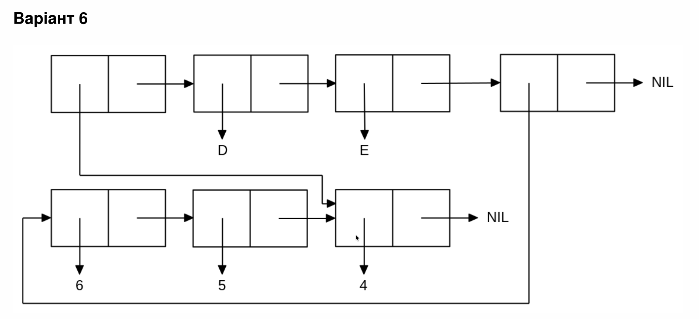

<p align="center"><b>МОНУ НТУУ КПІ ім. Ігоря Сікорського ФПМ СПіСКС</b></p>
<p align="center">
<b>Звіт з лабораторної роботи 1</b><br/>
"Обробка списків з використанням базових функцій"<br/>
дисципліни "Вступ до функціонального програмування"
</p>
<p align="right"><b>Студентка:</b> Гречишкіна Катерина Дмитрівна КВ-22</p>
<p align="right"><b>Рік:</b> 2025</p>
  
## Загальне завдання

1. Створіть список з п'яти елементів, використовуючи функції LIST і CONS . Форма
створення списку має бути одна — використання SET чи SETQ (або інших
допоміжних форм) для збереження проміжних значень не допускається. Загальна
кількість елементів (включно з підсписками та їх елементами) не має перевищувати
10-12 шт. (дуже великий список робити не потрібно). Збережіть створений список у
якусь змінну з SET або SETQ . Список має містити (напряму або у підсписках):
    - хоча б один символ
    - хоча б одне число
    - хоча б один не пустий підсписок
    - хоча б один пустий підсписок
2. Отримайте голову списку.
3. Отримайте хвіст списку.
4. Отримайте третій елемент списку.
5. Отримайте останній елемент списку.
6. Використайте предикати ATOM та LISTP на різних елементах списку (по 2-3
приклади для кожної функції).
7. Використайте на елементах списку 2-3 інших предикати з розглянутих у розділі 4
навчального посібника.
8. Об'єднайте створений список з одним із його непустих підсписків. Для цього
використайте функцію APPEND.

```lisp
;; Пункт 1 Створення списку з п'яти елементів
(defvar mylist nil)
(setq mylist (list 'A (cons 1 '()) (cons 'B (list 2)) () 'C))
(format t "Пункт 1: ~a~%" mylist)
(format t "---~%")

;; Пункт 2 Отримання голови списку
(format t "Пункт 2: ~a~%" (car mylist))
(format t "---~%")

;; Пункт 3 Отримання хвоста списку
(format t "Пункт 3: ~a~%" (cdr mylist))
(format t "---~%")

;; Пункт 4 Отримання третього елемента
(format t "Пункт 4: ~a~%" (third mylist))
(format t "---~%")

;; Пункт 5 Отримання останнього елемента
(format t "Пункт 5: ~a~%" (car (last mylist)))
(format t "---~%")

;; Пункт 6 Використання предикатів ATOM і LISTP
(format t "Пункт 6:~%")
(format t "  ATOM 'A: ~a~%" (atom (car mylist)))
(format t "  ATOM 'B: ~a~%" (atom (car (third mylist))))
(format t "  ATOM (2): ~a~%" (atom (cdr (third mylist))))
(format t "  LISTP (1): ~a~%" (listp (second mylist)))
(format t "  LISTP (B 2): ~a~%" (listp (third mylist)))
(format t "  LISTP 'A: ~a~%" (listp (car mylist)))
(format t "---~%")

;; Пункт 7 Використання інших предикатів
(format t "Пункт 7:~%")
(format t "  NUMBERP 1: ~a~%" (numberp (car (second mylist))))
(format t "  NUMBERP 'B: ~a~%" (numberp (car (third mylist))))
(format t "  EQUAL 'A 'A: ~a~%" (equal (car mylist) 'A))
(format t "  EQUAL 'A 'B: ~a~%" (equal (car mylist) (car (third mylist))))
(format t "---~%")

;; Пункт 8 Об'єднання списку з його підсписком
(format t "Пункт 8: ~a~%" (append mylist (third mylist)))
(format t "---~%")
```
### Результат виконання:

```lisp
Пункт 1: (A (1) (B 2) NIL C)
---
Пункт 2: A
---
Пункт 3: ((1) (B 2) NIL C)
---
Пункт 4: (B 2)
---
Пункт 5: C
---
Пункт 6:
  ATOM 'A: T
  ATOM 'B: T
  ATOM (2): NIL
  LISTP (1): T
  LISTP (B 2): T
  LISTP 'A: NIL
---
Пункт 7:
  NUMBERP 1: T
  NUMBERP 'B: NIL
  EQUAL 'A 'A: T
  EQUAL 'A 'B: NIL
---
Пункт 8: (A (1) (B 2) NIL C B 2)
---
```

## Завдання за варіантом 6

<p align="center">

</p>

```lisp
(defvar mylist nil)
(let ((x (list 'D 'E))  
      (y (list 6 5 4)))     
  (setq mylist (list 4 x y)))
(print mylist)
```
### Результат виконання:
```lisp
(4 (D E) (6 5 4))
```
