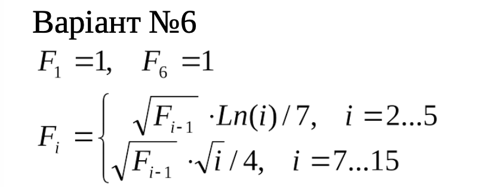
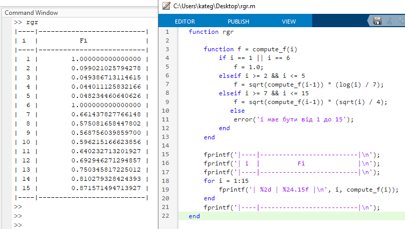

<p align="center"><b>МОНУ НТУУ КПІ ім. Ігоря Сікорського ФПМ СПіСКС</b></p>

<p align="center">
<b>Звіт з розрахунково-графічної роботи</b><br/>
дисципліни "Вступ до функціонального програмування"
</p>
<p align="right"><strong>Студентка:</strong> <i>Гречишкіна Катерина Дмитрівна КВ-22</i><p>
<p align="right"><strong>Рік:</strong> <i>2025</i><p>

## Загальне завдання

1. Реалізувати програму для обчислення функції згідно варіанту мовою Common Lisp.
Варіант обирається згідно списку варіантів для лабораторних робіт за модулем 16:
1 -> 1, 2 -> 2, ..., 17 -> 1, 18 -> 2 і т.д.
2. Виконати тестування реалізованої програми.
3. Порівняти результати роботи програми мовою Common Lisp с розрахунками іншими засобами.


## Варіант 6
<p align="center">

</p>
   
## Лістинг реалізації завдання
```lisp
(defun fi (i)
  (cond ((= i 1) 1.0)
        ((= i 6) 1.0)
        ((<= 2 i 5) (* (sqrt (fi (- i 1))) (/ (log i) 7.0)))
        ((<= 7 i 15) (* (sqrt (fi (- i 1))) (/ (sqrt i) 4.0)))
        (t (error "i має бути від 1 до 15"))))
```

## Тестові набори та утиліти
```lisp
(defun print-row-rec (current max-val)
  (when (<= current max-val)
    (format t "| ~2d | ~20,15f |~%" current (fi current))
    (print-row-rec (+ current 1) max-val)))

(defun print-table ()
  (format t "|----|----------------------|~%")
  (format t "| i  |         Fi           |~%")
  (format t "|----|----------------------|~%")
  (print-row-rec 1 15)
  (format t "|----|----------------------|~%"))

(print-table)
```

### Тестування
```
|----|----------------------|
| i  |         Fi           |
|----|----------------------|
|  1 |    1.000000000000000 |
|  2 |    0.099021025000000 |
|  3 |    0.049386717000000 |
|  4 |    0.044011127000000 |
|  5 |    0.048234463000000 |
|  6 |    1.000000000000000 |
|  7 |    0.661437800000000 |
|  8 |    0.575081650000000 |
|  9 |    0.568756040000000 |
| 10 |    0.596215200000000 |
| 11 |    0.640232740000000 |
| 12 |    0.692946260000000 |
| 13 |    0.750345800000000 |
| 14 |    0.810279370000000 |
| 15 |    0.871571540000000 |
|----|----------------------|
```

### Порівняння з результатами Matlab
<p align="center">

</p>
